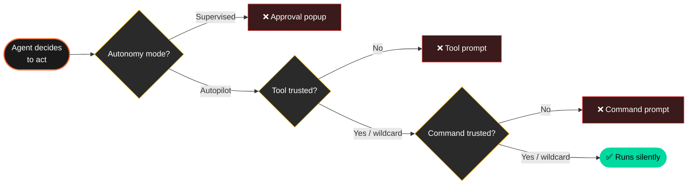

<!-- markdownlint-disable MD033 MD041 MD013 -->

<a id="top"></a>

<!-- ░░░░░░░░░░░░░░░░░░░░░  ANIMATED HERO BANNER  ░░░░░░░░░░░░░░░░░░░░░ -->
<p align="center">
  <a href="#top">
    
  </a>
</p>

<!-- ░░░░░░░░░░░░░░░░░░░░░  ANIMATED TYPING TAGLINE  ░░░░░░░░░░░░░░░░░░░░░ -->
<p align="center">
  <a href="https://kiro.dev">
    
  </a>
</p>

<!-- ░░░░░░░░░░░░░░░░░░░░░  STATUS BADGES  ░░░░░░░░░░░░░░░░░░░░░ -->
<p align="center">
  <a href="LICENSE"></a>
  <a href="https://learn.microsoft.com/powershell/"></a>
  
  
  
  <a href="../../actions/workflows/ci.yml"></a>
  <a href="CONTRIBUTING.md"></a>
</p>

<!-- ░░░░░░░░░░░░░░░░░░░░░  KIRO + AUTONOMY 3D BADGE PAIR  ░░░░░░░░░░░░░░░░░░░░░ -->
<p align="center">
  <a href="https://kiro.dev">
    
  </a>
  &nbsp;
  
  &nbsp;
  
</p>

<!-- ░░░░░░░░░░░░░░░░░░░░░  SOCIAL COUNTERS  ░░░░░░░░░░░░░░░░░░░░░ -->
<p align="center">
  <a href="../../stargazers"></a>
  <a href="../../network/members"></a>
  <a href="../../watchers"></a>
  
</p>

<!-- ░░░░░░░░░░░░░░░░░░░░░  NAVIGATION  ░░░░░░░░░░░░░░░░░░░░░ -->
<p align="center">
  <a href="#-quick-start"><b>Quick&nbsp;Start</b></a> &nbsp;•&nbsp;
  <a href="#-the-problem"><b>The&nbsp;Problem</b></a> &nbsp;•&nbsp;
  <a href="#-how-it-works"><b>How&nbsp;It&nbsp;Works</b></a> &nbsp;•&nbsp;
  <a href="#-recipes"><b>Recipes</b></a> &nbsp;•&nbsp;
  <a href="docs/SECURITY.md"><b>Safety</b></a> &nbsp;•&nbsp;
  <a href="docs/TROUBLESHOOTING.md"><b>Troubleshooting</b></a> &nbsp;•&nbsp;
  <a href="docs/VERIFICATION.md"><b>Reverse&nbsp;Engineering</b></a>
</p>

<!-- ░░░░░░░░░░░░░░░░░░░░░  ANIMATED DIVIDER  ░░░░░░░░░░░░░░░░░░░░░ -->
<p align="center">
  
</p>


</p>


##  The Problem

You set Kiro to **Autopilot** expecting it to run autonomously. Then every shell command and tool call still pops a `Trust / Run / Reject` dialog that yanks you out of flow:

<table align="center">
<tr>
<td align="center">

```
┌─────────────────────────────────────────────────────────┐
│   ⚠   Waiting on your input                             │
│                                                         │
│   git status                                            │
│   This command needs your approval to run.              │
│                                                         │
│             [ Reject ]   [ Trust ]   [ Run ]            │
└─────────────────────────────────────────────────────────┘
```

</td>
</tr>
<tr><td align="center"><i>Click <b>Trust</b>. Whitelisted. Run a slightly different command? New popup.</i></td></tr>
</table>

The Settings UI does not expose a "trust everything" option. The docs do not mention one exists. Most users hit `Trust` 30 times a session and never realize there is a better way.

<p align="center">
  
</p>

---

##  The Fix

Kiro's `trustedCommands` matcher **does** support a `"*"` wildcard. It's just hidden. This repo gives you:

<table>
<tr>
<td width="33%" align="center">
  <br/>
  <b>One-click installer</b><br/>
  <sub>Configures it correctly without breaking your existing settings.</sub>
</td>
<td width="33%" align="center">
  <br/>
  <b>Verified internals</b><br/>
  <sub>The actual decision logic, dug out of the compiled extension.</sub>
</td>
<td width="33%" align="center">
  <br/>
  <b>Recipe configs</b><br/>
  <sub>From cautious to maximum autonomy. Reversible. Backed up.</sub>
</td>
</tr>
</table>

---

##  Quick Start

<details open>
<summary><b>Windows · PowerShell</b></summary>

```powershell
iwr -useb https://raw.githubusercontent.com/Shivam990q/kiro-autonomy/main/scripts/install.ps1 | iex
```

Or download and double-click [`enable-kiro-autonomy.bat`](scripts/enable-kiro-autonomy.bat).
</details>

<details>
<summary><b>macOS · Linux</b></summary>

```bash
curl -fsSL https://raw.githubusercontent.com/Shivam990q/kiro-autonomy/main/scripts/install.sh | bash
```
</details>

<details>
<summary><b>Manual · any OS</b></summary>

Add this to your Kiro user `settings.json`:

```jsonc
{
  "kiroAgent.agentAutonomy": "Autopilot",
  "kiroAgent.trustedTools": ["*"],
  "kiroAgent.trustedCommands": ["*"]
}
```

Settings location:

| OS | Path |
|---|---|
| Windows | `%APPDATA%\Kiro\User\settings.json` |
| macOS | `~/Library/Application Support/Kiro/User/settings.json` |
| Linux | `~/.config/Kiro/User/settings.json` |

Then reload: `Ctrl+Shift+P` → `Developer: Reload Window`.
</details>

<p align="center">
  
</p>

---

##  Why This Exists

We dug into Kiro's compiled extension (`kiro.kiro-agent` v0.3.433) to find the actual decision logic. The matcher is six lines of JavaScript and explicitly accepts a wildcard:

```js
function matches(cmd, trusted, denied) {
  if (denied.some(d => cmd.includes(d))) return false;
  if (trusted.includes("*")) return true;          // ← the wildcard
  return trusted.some(t => /* exact / prefix match */);
}
```

But this isn't documented, and the Settings UI never exposes it. **This repo fixes that.**

Full reverse-engineering writeup: **[docs/VERIFICATION.md](docs/VERIFICATION.md)**.

---

##  How It Works

Kiro has **three independent approval gates**. To go fully autonomous you flip all three.



| Gate | Setting | Wildcard | Effect |
|---|---|---|---|
| **Autonomy mode** | `kiroAgent.agentAutonomy` | `"Autopilot"` | No per-edit approvals |
| **Tool trust** | `kiroAgent.trustedTools` | `["*"]` | No tool approval prompts |
| **Command trust** | `kiroAgent.trustedCommands` | `["*"]` | No shell command popups |

The installer sets all three correctly, preserves your other settings, and creates a timestamped backup.

Detailed walkthrough: **[docs/GUIDE.md](docs/GUIDE.md)**.

---

##  What's In This Repo

```text
kiro-autonomy/
│
├─ scripts/                                ⚙  installers
│  ├─ Enable-KiroFullAutonomy.ps1          cross-platform PowerShell installer
│  ├─ enable-kiro-autonomy.sh              bash installer (macOS / Linux)
│  ├─ enable-kiro-autonomy.bat             double-click launcher (Windows)
│  ├─ install.ps1                          one-liner remote installer (Win)
│  └─ install.sh                           one-liner remote installer (Unix)
│
├─ examples/                               🧪  drop-in configs
│  ├─ settings.maximum.json                trust everything (this repo's default)
│  ├─ settings.aggressive.json             trust common dev commands only
│  ├─ settings.conservative.json           read-only trust, supervised edits
│  └─ settings.workspace-override.json     restrict trust per-workspace
│
├─ docs/                                   📖  the manual
│  ├─ GUIDE.md                             complete 14-section reference
│  ├─ RECIPES.md                           config recipes for every workflow
│  ├─ TROUBLESHOOTING.md                   every "it's still asking" cause
│  ├─ SECURITY.md                          real risks of full trust
│  ├─ VERIFICATION.md                      confirm the matcher logic yourself
│  └─ FAQ.md                               common questions
│
├─ tests/Test-Script.ps1                   ✅  installer smoke tests (28 assertions)
└─ .github/                                🤖  CI · issue templates · dependabot
```

---

##  Recipes

Pick the autonomy level that fits how you work. Full set in **[docs/RECIPES.md](docs/RECIPES.md)**.

<table>
<tr>
<td width="50%" valign="top">

#### 

Trust everything. Repo default.

```jsonc
{
  "kiroAgent.agentAutonomy": "Autopilot",
  "kiroAgent.trustedTools": ["*"],
  "kiroAgent.trustedCommands": ["*"]
}
```

</td>
<td width="50%" valign="top">

#### 

Common dev commands only, rest gated.

→ [`examples/settings.aggressive.json`](examples/settings.aggressive.json)

</td>
</tr>
<tr>
<td width="50%" valign="top">

#### 

Read-only trust, supervised edits.

→ [`examples/settings.conservative.json`](examples/settings.conservative.json)

</td>
<td width="50%" valign="top">

#### 

Globally trust, lock down sensitive projects.

→ [`examples/settings.workspace-override.json`](examples/settings.workspace-override.json)

</td>
</tr>
</table>

---

##  Safety First

`trustedCommands: ["*"]` means Kiro will run anything its agent decides will help, including:

- `rmdir /s /q`, `del /f /s /q`, `rm -rf`
- `git push --force`, `git reset --hard`, `git clean -fdx`
- Database mutations via MCP servers
- Outbound network requests with credentials

The agent's **system prompt** still has guardrails for the most dangerous categories, but IDE-level approval prompts are gone.

> [!WARNING]
> Use this in workspaces where you control the blast radius: dev VMs, containers, projects under git, throwaway sandboxes. For sensitive workspaces, drop a workspace `.vscode/settings.json` that overrides global trust — see [`examples/settings.workspace-override.json`](examples/settings.workspace-override.json).

Full risk and rollback details: **[docs/SECURITY.md](docs/SECURITY.md)**.

---

##  Rollback

Every install creates a timestamped backup. To restore:

```powershell
# Windows / cross-platform
pwsh -File scripts/Enable-KiroFullAutonomy.ps1 -Restore
```

```bash
# Unix
./scripts/enable-kiro-autonomy.sh --restore
```

Or manually copy the backup file (`settings.json.bak.YYYYMMDD-HHMMSS`) over `settings.json`.

---

##  Requirements

| | |
|---|---|
| 🟧 **Kiro IDE** | any recent version (verified against `kiro.kiro-agent` v0.3.433) |
| 🟦 **Windows** | PowerShell 5.1+ (built into Windows 10/11) |
| 🍎 **macOS** | PowerShell 7 (`pwsh`) **or** bash 4+ |
| 🐧 **Linux** | PowerShell 7 (`pwsh`) **or** bash 4+ |

---

##  Contributing

Issues and PRs welcome. See [CONTRIBUTING.md](CONTRIBUTING.md).

Kinds of contributions especially appreciated:

- 🧰 New recipe configs for specific stacks (Python, Rust, Go, .NET, mobile)
- 🔬 Verified findings from new Kiro versions
- 🌐 Translations of the guide
- ✨ Better examples and tutorials

---

##  Publishing Your Fork

Cloned this repo and want to publish under your own GitHub account? Find-and-replace `Shivam990q` with your handle in `README.md`, `CHANGELOG.md`, `CONTRIBUTING.md`, `SECURITY.md`, and the `scripts/` folder. Then:

```powershell
git init -b main
git add .
git commit -m "Initial release"
gh repo create kiro-autonomy --public --source=. --push
```

CI runs on first push and validates everything: JSON, Markdown, PowerShell, bash, plus end-to-end installer smoke tests on Linux / macOS / Windows.

---

##  License & Credits

[MIT](LICENSE) — do whatever you want, no warranty.

Built by reverse-engineering Kiro's `kiro.kiro-agent` extension. Not affiliated with, endorsed by, or supported by AWS or the Kiro team. Kiro™ is a trademark of its respective owner. This is independent community documentation.

---

<!-- ░░░░░░░░░░░░░░░░░░░░░  CALL TO ACTION  ░░░░░░░░░░░░░░░░░░░░░ -->

<p align="center">
  
</p>

<p align="center">
  <a href="../../stargazers">
    
  </a>
  &nbsp;
  <a href="https://github.com/Shivam990q/kiro-autonomy/issues/new?template=bug_report.md">
    
  </a>
  &nbsp;
  <a href="https://github.com/Shivam990q/kiro-autonomy/issues/new?template=feature_request.md">
    
  </a>
  &nbsp;
  <a href="docs/GUIDE.md">
    
  </a>
</p>

<!-- ░░░░░░░░░░░░░░░░░░░░░  ANIMATED FOOTER WAVE  ░░░░░░░░░░░░░░░░░░░░░ -->
<p align="center">
  
</p>

<p align="center"><sub><a href="#top">⬆ back to top</a></sub></p>
